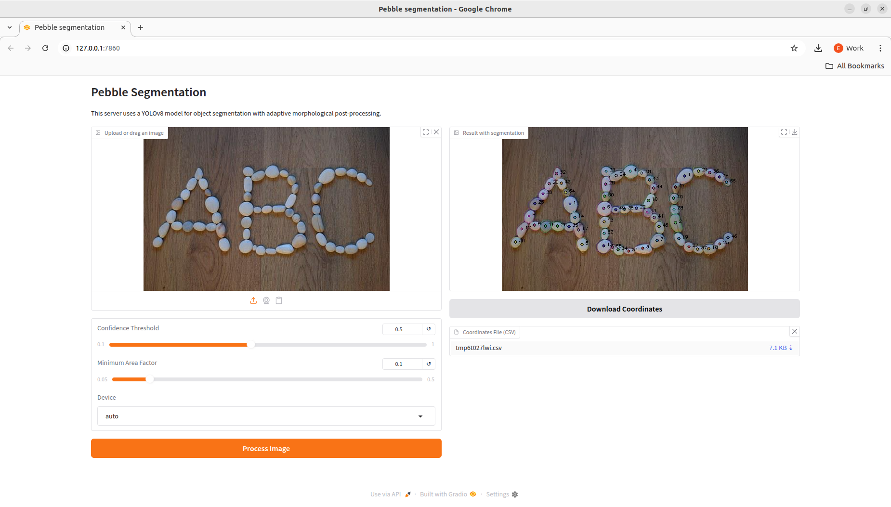

# Pebble Contours

Author: Enrique García Iglesias  
Version: 1  
Date: 14/08/2025

A contour segmentation tool for pebbles using YOLO-based AI segmentation. Includes an interactive Gradio web UI and batch-processing mode.

## Table of Contents

- [Prerequisites](#prerequisites)
- [Installation](#installation)
- [Usage](#usage)
  - [Interactive Mode (Gradio)](#interactive-mode-gradio)
  - [Batch Inference](#batch-inference)
- [Extra Scripts](#extra-scripts)
- [Example Interface](#example-interface)
- [License](#license)

## Prerequisites

Make sure the following are installed on your system:

- [Python 3.10](https://realpython.com/installing-python/)
- [Anaconda Distribution](https://www.anaconda.com/docs/getting-started/anaconda/install#macos-linux-installation)

To verify installation:

```bash
python3 -m pip --version
conda --version
```

## Installation

1. Create a conda environment:

```bash
conda create -n pebble_contours python=3.10
```

2. Activate the environment and install dependencies:

```bash
conda activate pebble_contours
pip install -r requirements.txt
```

## Usage

### Interactive Mode (Gradio)

To launch the interactive Gradio interface:

```bash
python3 code/serving_gradio/gradio_server.py
```

You’ll get a local URL (e.g. http://127.0.0.1:7860) and possibly a temporary public Gradio link.

Features:
- Upload image
- Adjust:
  - Confidence threshold
  - Minimum area factor
  - Inference device (auto / cpu / gpu)
- Download processed image and CSV with:
  - Mask_ID
  - Centroid_X / Centroid_Y
  - Polygon_Coordinates

### Example Interface



### Batch Inference

To process all images in a folder:

```bash
python3 code/model_usage/final_inference_version_on_folder.py path/input/folder path/output/folder --confidence 0.6 --area_factor 0.15 --device cpu
```

Output:
- JPG with visualized masks
- CSV with mask ID, centroid, polygon coordinates

## Extra Scripts

Located in the `code/` directory.

### code/dataset_creation/
- `check_dataset.py`: View YOLO annotations
- `sv_checker.py`: Visualize a single image
- `sv_dataset_annotator.py`: Auto-annotate with SAM
- `prueba_inicial.py`: OpenCV-only segmentation

### code/model_training/
- `yolotrain.py`: YOLO training script
- `smooth_dataset.py`: Smooths contour labels
- `select_frames.py`: Filters valid frames from dataset

### code/model_usage/
- `final_inference_version_on_folder.py`: Final batch inference
- `inference_v1.py`, `inference_v2_*.py`: Older versions

### code/serving_gradio/
- `gradio_server.py`: UI web server
- `inference_yolo_adapter.py`: YOLO integration

## License

This project is delivered as-is. For redistribution or commercial use, contact the author or contracting organization.
